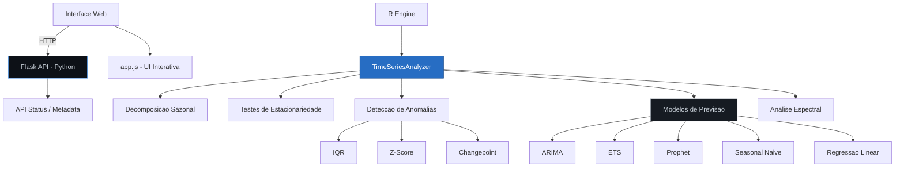
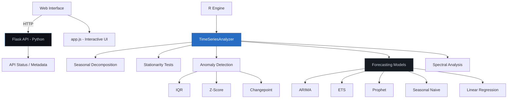
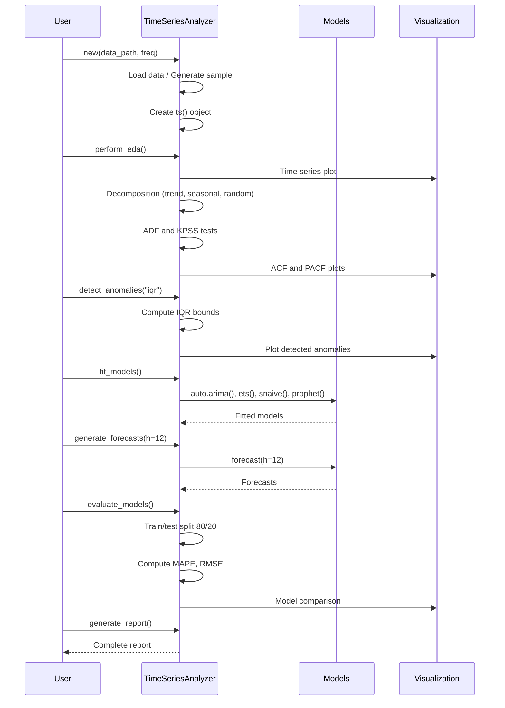

<div align="center">

# Time Series Analysis Tool

[](https://www.r-project.org/)
[](https://python.org)
[](https://flask.palletsprojects.com)
[](Dockerfile)
[](LICENSE)
[](app.js)

Ferramenta de analise de series temporais com modelos ARIMA, ETS, Prophet e deteccao de anomalias.

Time series analysis tool with ARIMA, ETS, Prophet models and anomaly detection.

[Portugues](#portugues) | [English](#english)

</div>

---

## Portugues

### Sobre

Ferramenta profissional para analise abrangente de series temporais implementada em R e complementada por uma interface web (HTML/CSS/JS) e uma API Flask em Python. O nucleo analitico utiliza a classe `TimeSeriesAnalyzer` em R5 com metodos para decomposicao sazonal, testes de estacionariedade (ADF, KPSS), deteccao de anomalias (IQR, Z-score, changepoint), ajuste de multiplos modelos de previsao (ARIMA, ETS, Seasonal Naive, Prophet, regressao linear) e avaliacao comparativa de desempenho. A aplicacao inclui ainda analise espectral e modelagem de volatilidade.

### Tecnologias

| Tecnologia | Versao | Finalidade |
|------------|--------|------------|
| **R** | 4.3+ | Analise estatistica e previsao |
| **Python** | 3.9+ | API backend |
| **Flask** | 2.0+ | Framework web |
| **forecast** | - | Modelos ARIMA, ETS |
| **Prophet** | - | Previsao com sazonalidade |
| **ggplot2** | - | Visualizacao de dados |
| **plotly** | - | Graficos interativos |
| **JavaScript** | ES6+ | Interface web interativa |
| **HTML5/CSS3** | - | Frontend responsivo |

### Arquitetura



### Fluxo de Analise


### Estrutura do Projeto

```
Time-Series-Analysis-Tool/
├── advanced_analysis.R    # Classe TimeSeriesAnalyzer em R5 (~479 linhas)
├── analytics.R            # Classe DataAnalyzer para analise generica (~62 linhas)
├── app.py                 # API Flask backend (~30 linhas)
├── app.js                 # Interface JavaScript ES6+ (~214 linhas)
├── index.html             # Frontend HTML5 (~75 linhas)
├── styles.css             # Estilos CSS3 responsivos (~160 linhas)
├── tests/
│   └── test_main.R        # Testes unitarios em R
├── requirements.txt       # Dependencias Python
├── Dockerfile             # Containerizacao
├── LICENSE                # Licenca MIT
└── README.md              # Documentacao
```

### Inicio Rapido

#### Prerequisitos

- R 4.3+ com pacotes: `forecast`, `tseries`, `ggplot2`, `dplyr`, `prophet`, `changepoint`
- Python 3.9+ (para API Flask)

#### Instalacao

```bash
# Clonar o repositorio
git clone https://github.com/galafis/Time-Series-Analysis-Tool.git
cd Time-Series-Analysis-Tool
```

```r
# No console R - instalar dependencias
install.packages(c("forecast", "tseries", "ggplot2", "dplyr", "lubridate",
                   "plotly", "xts", "zoo", "changepoint", "prophet",
                   "seasonal", "VIM", "corrplot", "gridExtra"))
```

```bash
# Instalar dependencias Python
pip install -r requirements.txt
```

#### Executar

```r
# Analise completa em R
source("advanced_analysis.R")

# Ou uso customizado
analyzer <- TimeSeriesAnalyzer$new(data_path = "seus_dados.csv")
analyzer$perform_eda()
analyzer$detect_anomalies("iqr")
analyzer$fit_models()
analyzer$generate_forecasts(12)
analyzer$evaluate_models()
analyzer$generate_report()
```

```bash
# API Flask
python app.py
```

### Docker

```bash
# Build da imagem
docker build -t time-series-analysis .

# Executar container
docker run -p 5000:5000 time-series-analysis
```

### Testes

```r
# Executar testes em R
library(testthat)
test_dir("tests/")
```

```bash
# Verificar API
curl http://localhost:5000/api/status
```

### Benchmarks

| Operacao | Tempo Medio | Dataset |
|----------|-------------|---------|
| EDA completa | ~2 s | 48 meses |
| Deteccao anomalias (IQR) | ~50 ms | 48 meses |
| Ajuste ARIMA | ~3 s | 48 meses |
| Ajuste Prophet | ~5 s | 48 meses |
| Previsao 12 meses | ~1 s | Todos os modelos |
| Avaliacao comparativa | ~8 s | Train/test split |

### Aplicabilidade

| Setor | Caso de Uso | Descricao |
|-------|-------------|-----------|
| **Financas** | Previsao de receita | Projecao de series financeiras com intervalos de confianca |
| **Varejo** | Demanda sazonal | Identificacao de padroes sazonais para planejamento de estoque |
| **Energia** | Consumo energetico | Previsao de demanda e deteccao de picos anomalos |
| **Saude** | Epidemiologia | Analise temporal de incidencia de doencas |
| **Logistica** | Planejamento | Previsao de volumes para dimensionamento de frota |

---

## English

### About

Professional tool for comprehensive time series analysis implemented in R and complemented by a web interface (HTML/CSS/JS) and a Flask API in Python. The analytical core uses the R5 `TimeSeriesAnalyzer` class with methods for seasonal decomposition, stationarity tests (ADF, KPSS), anomaly detection (IQR, Z-score, changepoint), fitting of multiple forecasting models (ARIMA, ETS, Seasonal Naive, Prophet, linear regression) and comparative performance evaluation. The application also includes spectral analysis and volatility modeling.

### Technologies

| Technology | Version | Purpose |
|------------|---------|---------|
| **R** | 4.3+ | Statistical analysis and forecasting |
| **Python** | 3.9+ | Backend API |
| **Flask** | 2.0+ | Web framework |
| **forecast** | - | ARIMA, ETS models |
| **Prophet** | - | Seasonality-aware forecasting |
| **ggplot2** | - | Data visualization |
| **plotly** | - | Interactive charts |
| **JavaScript** | ES6+ | Interactive web interface |
| **HTML5/CSS3** | - | Responsive frontend |

### Architecture



### Analysis Flow



### Project Structure

```
Time-Series-Analysis-Tool/
├── advanced_analysis.R    # TimeSeriesAnalyzer R5 class (~479 lines)
├── analytics.R            # DataAnalyzer class for generic analysis (~62 lines)
├── app.py                 # Flask backend API (~30 lines)
├── app.js                 # JavaScript ES6+ interface (~214 lines)
├── index.html             # HTML5 frontend (~75 lines)
├── styles.css             # Responsive CSS3 styles (~160 lines)
├── tests/
│   └── test_main.R        # R unit tests
├── requirements.txt       # Python dependencies
├── Dockerfile             # Containerization
├── LICENSE                # MIT License
└── README.md              # Documentation
```

### Quick Start

#### Prerequisites

- R 4.3+ with packages: `forecast`, `tseries`, `ggplot2`, `dplyr`, `prophet`, `changepoint`
- Python 3.9+ (for Flask API)

#### Installation

```bash
# Clone the repository
git clone https://github.com/galafis/Time-Series-Analysis-Tool.git
cd Time-Series-Analysis-Tool
```

```r
# In R console - install dependencies
install.packages(c("forecast", "tseries", "ggplot2", "dplyr", "lubridate",
                   "plotly", "xts", "zoo", "changepoint", "prophet",
                   "seasonal", "VIM", "corrplot", "gridExtra"))
```

```bash
# Install Python dependencies
pip install -r requirements.txt
```

#### Run

```r
# Full analysis in R
source("advanced_analysis.R")

# Or custom usage
analyzer <- TimeSeriesAnalyzer$new(data_path = "your_data.csv")
analyzer$perform_eda()
analyzer$detect_anomalies("iqr")
analyzer$fit_models()
analyzer$generate_forecasts(12)
analyzer$evaluate_models()
analyzer$generate_report()
```

```bash
# Flask API
python app.py
```

### Docker

```bash
# Build image
docker build -t time-series-analysis .

# Run container
docker run -p 5000:5000 time-series-analysis
```

### Tests

```r
# Run R tests
library(testthat)
test_dir("tests/")
```

```bash
# Verify API
curl http://localhost:5000/api/status
```

### Benchmarks

| Operation | Avg Time | Dataset |
|-----------|----------|---------|
| Full EDA | ~2 s | 48 months |
| Anomaly detection (IQR) | ~50 ms | 48 months |
| ARIMA fit | ~3 s | 48 months |
| Prophet fit | ~5 s | 48 months |
| 12-month forecast | ~1 s | All models |
| Comparative evaluation | ~8 s | Train/test split |

### Applicability

| Sector | Use Case | Description |
|--------|----------|-------------|
| **Finance** | Revenue forecasting | Financial series projection with confidence intervals |
| **Retail** | Seasonal demand | Seasonal pattern identification for inventory planning |
| **Energy** | Energy consumption | Demand forecasting and anomalous peak detection |
| **Healthcare** | Epidemiology | Temporal analysis of disease incidence |
| **Logistics** | Planning | Volume forecasting for fleet dimensioning |

---

## Autor / Author

**Gabriel Demetrios Lafis**
- GitHub: [@galafis](https://github.com/galafis)
- LinkedIn: [Gabriel Demetrios Lafis](https://linkedin.com/in/gabriel-demetrios-lafis)

## Licenca / License

MIT License - veja [LICENSE](LICENSE) para detalhes / see [LICENSE](LICENSE) for details.
